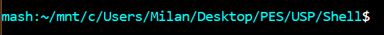
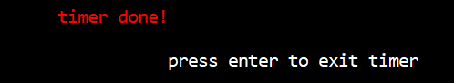
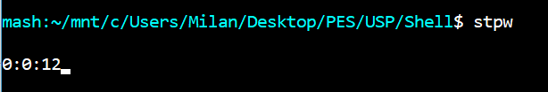
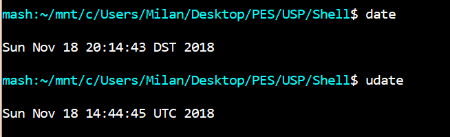
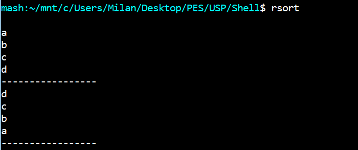
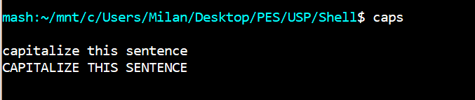
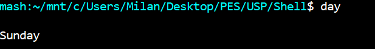

Custom Linux shell 

Prerequites:
1. Linux based system 
2. C compiler such as GCC

To run:
1. In the terminal run `gcc shell.c`
2. In the terminal execute `./a.out`

Now the shell should show up with a light blue text, with the current directory 

Along with the standard functionality of a linux shell, our custom implementattion also provides the following features:

1. Timer
A timer which sets the timer for a given number of seconds or minutes as an option, and notifies the user after the time elapses

Command : $`timer <seconds> [m]`

2. StopWatch
A stopwatch begins and shows the time elapsed till any key is pressed

Command : $`stpw`

3. History Management
Command history management with Windows-style bidirectional scrolling with UP and DOWN arrow keys  

4. Date in UTC timezone
displays the current date and time in UTC timezone

Command: $`udate`

5. Reverse sort
Sorts anything and everything in reverse :)

Command : $`rsort`

6. Caps
Capitalizes the text provided

Command: $`caps`

7. Current day of the week
Shows the current day in the week

Command : $`day`

